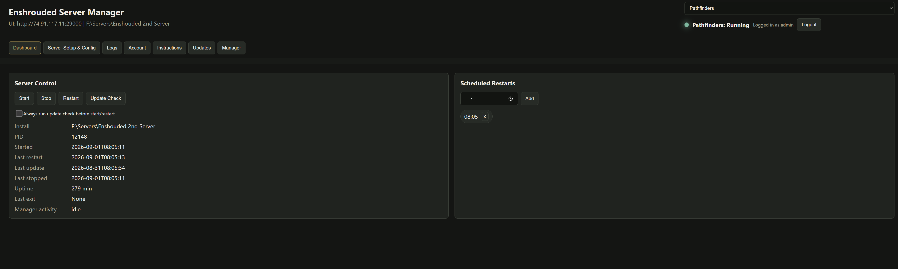

# Enshrouded Server Manager

A Windows-friendly web manager for running one or more Enshrouded dedicated server instances from a browser.

Current release: **v0.8.0**

Shareable package: [`release/EnshroudedServerManager-PythonRequired-v0.8.0.zip`](release/EnshroudedServerManager-PythonRequired-v0.8.0.zip)

## What It Does

- Runs a web UI locally or over the network.
- Starts, stops, restarts, and update-checks Enshrouded dedicated servers.
- Manages multiple server instances from one manager UI.
- Installs SteamCMD and fresh Enshrouded dedicated server instances when needed.
- Adds existing dedicated server installs when you already know the folder path.
- Monitors server state and can restart crashed servers unless they were intentionally stopped.
- Keeps game server processes persistent when the manager itself is closed or updated.
- Edits server config, game user groups, bans, saves, backups, scheduled restarts, and logs.
- Supports admin-created users, invite-code account creation, server-owner scoped users, and role-based visibility.
- Imports local player worlds into a dedicated server workflow.
- Creates local backups and optional FTP backups.
- Sends Discord or generic JSON webhook notifications for server and manager update events.
- Checks GitHub releases for manager updates on an admin-configured interval.
- Includes an in-app Instructions tab and Updates tab.

## Quick Install

Use the Python-required release if Python 3.11 or newer is already installed on the server.

1. Download [`release/EnshroudedServerManager-PythonRequired-v0.8.0.zip`](release/EnshroudedServerManager-PythonRequired-v0.8.0.zip).
2. Extract it to the machine that will host the manager.
3. Run `Run Enshrouded Server Manager.bat`.
4. Open `http://127.0.0.1:8080` on that machine.
5. Use the Manager tab to change the listen address and port if you want access from another machine.

Fresh installs listen on localhost only. Port `8080` is not exposed to the network unless you change the listen address and open the port on the host.

Full setup notes are in [Install Guide](docs/INSTALL.md).

## First Server

On first load, the manager asks you to add a server instance.

Choose one:

- Point to an existing Enshrouded dedicated server folder that already contains `enshrouded_server.exe`.
- Install a new dedicated server. The manager downloads SteamCMD into the manager folder, installs the server, starts it once to create `enshrouded_server.json`, then stops it so it is ready for configuration.

New installs can take several minutes. If SteamCMD is being downloaded for the first time or the host connection is slow, expect 10-20 minutes or longer.

## Documentation

- [Install Guide](docs/INSTALL.md)
- [Feature Guide](docs/FEATURES.md)
- [Release Notes](docs/RELEASES.md)
- [Screenshots](docs/SCREENSHOTS.md)
- [User Guide](enshrouded_manager/USER_README.md)
- [Admin Notes](enshrouded_manager/README.md)

## Repository Layout

- `enshrouded_manager/manager.py` - manager backend and API
- `enshrouded_manager/static/` - web UI
- `enshrouded_manager/README.md` - admin/setup notes included with the package
- `enshrouded_manager/USER_README.md` - non-admin user guide included with the package
- `docs/` - repository documentation and screenshots
- `release/` - current shareable release zip

Runtime data, logs, SteamCMD, installed game servers, and generated `dist/` output are intentionally ignored by git.
